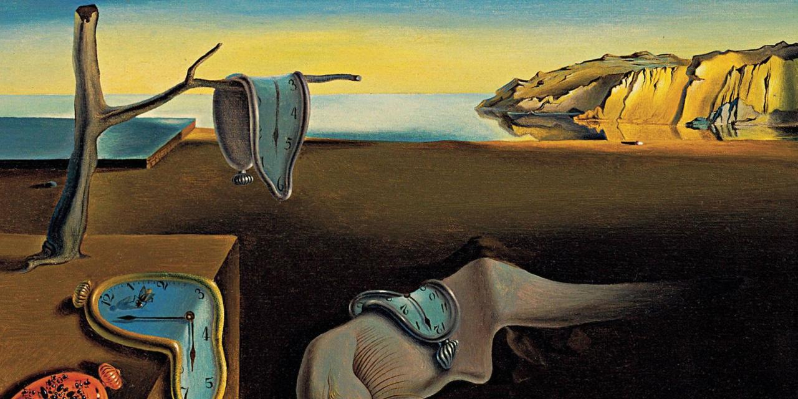

*********************
Step-by-step tutorial
*********************

Section 1
^^^^^^^^^

In between

Subsection 1
------------

First you have to run some command line stuff

.. code-block:: bash

    wget http://ichef.bbci.co.uk/wwfeatures/wm/live/1280_640/images/live/p0/52/1q/p0521q8t.jpg
    mv p0521q8t.jpg dali.jpg

Then run in python interpreter

.. code-block:: python

    import struct_lmm
    struct_lmm.run("dali.jpg")

.. plot::
    :include-source:

    import matplotlib.pyplot as plt
    plt.plot([1,2,3,4])
    plt.ylabel('some numbers')
    plt.show()
